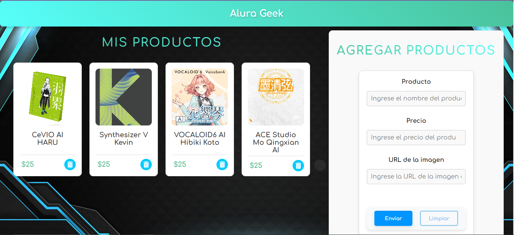

# Alura Geek

Repositorio del challenge Alura Geek, una aplicación web para mostrar y gestionar productos.

## Descripción

Alura Geek es una aplicación web diseñada para mostrar una lista de productos y permitir a los usuarios agregar nuevos productos, así como eliminar los existentes. Los usuarios también pueden ver detalles de cada producto, como el título, el precio y la imagen.

## Características

- Lista de productos electrónicos.
- Agregar nuevos productos.
- Eliminar productos existentes.
- Detalles de cada producto, incluyendo título, precio e imagen.

## Tecnologías utilizadas

- HTML
- CSS
- JavaScript
- JSON Server (para simular una API REST)
- Node.JS

## Uso

- Navega por la lista de productos en la página principal.
- Agrega nuevos productos utilizando el formulario de la sección "Agregar Productos".
- Haz clic en el botón de eliminar para eliminar un producto existente.

## Capturas de pantalla

